# Quick Start

Please find instructions on quick usage below.

<!-- TOC -->
### Table of Contents
* [1. Launching](#1-launching)
* [2. Features](#2-features)
* [3. Quick start example](#3-quick-start-example)
* [4. Usage](#4-usage)
  * [4.1. Workspace Tools](#41-workspace-tools)
  * [4.2. Object tools](#42-object-tools)
  * [4.3. Instrumentation mode and discoverability](#43-instrumentation-mode-and-discoverability)
  * [4.4. Logging](#44-logging)
  * [4.5. Menu](#45-menu)
    * [4.5.1. File](#451-file)
    * [4.5.2. Workspace](#452-workspace)
    * [4.5.1. Window](#451-window)
    * [4.5.1. Help](#451-help)
  * [4.6. Documents](#46-documents)
* [5. Workspace Explorer](#5-workspace-explorer)
* [6. File Explorer](#6-file-explorer)
* [7. Shader Objects](#7-shader-objects)
* [8. Pipeline Objects](#8-pipeline-objects)
* [9. Properties](#9-properties)
  * [9.1. Workspace Properties](#91-workspace-properties)
  * [9.2. Instrumentation Properties](#92-instrumentation-properties)
* [10. Workspaces](#10-workspaces)
  * [10.1. Workspace Instrumentation](#101-workspace-instrumentation)
* [11. Shaders](#11-shaders)
* [12. Discoverability](#12-discoverability)
* [13. Instrumentation mode](#13-instrumentation-mode)
* [14. Application launching](#14-application-launching)
* [15. Settings](#15-settings)
<!-- TOC -->

## 1. Launching

To start GPU Reshape, please navigate to the built package and launch `GPUReshape.exe`.
Upon launch the following screen will be presented:

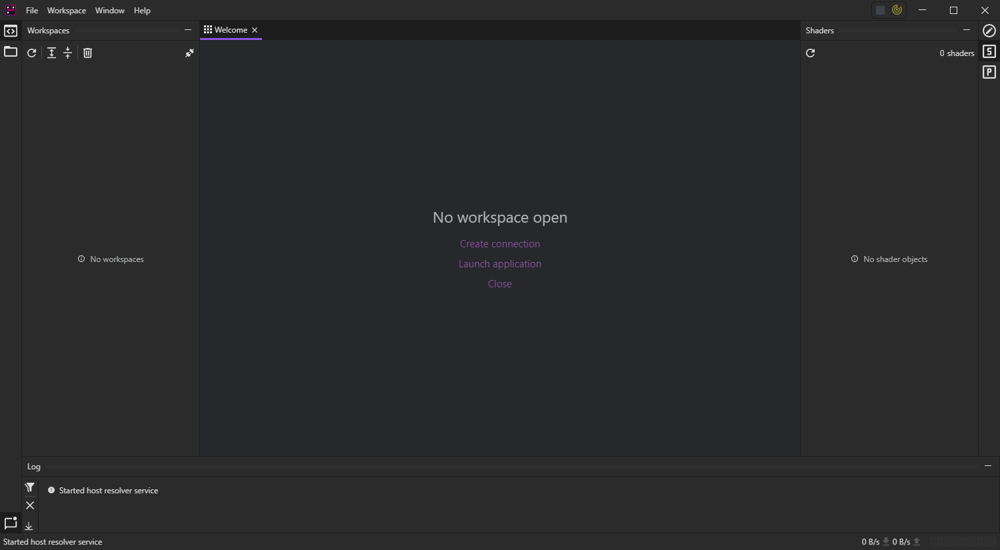

**Typical usage of the tool does not require any application integration**, optimal usage of the tool however
does require that the shaders are built with debug information. Both embedded and exported (PDB) debug data is supported.

## 2. Features

GPU Reshape, as of today, supports the following features. 

- **Resource Bounds**. Validation that intra-resource indexing, on either reads or writes, are within bounds.
- **Export Stability**. Validation that shader and resource exports are numerically stable (floating point, Inf / NaN).
- **Descriptor**. Validation that descriptors, potentially dynamically indexed, are valid. This includes undefined descriptors, 
  mismatched (compile time to runtime mismatch) descriptors, and out of bounds descriptor indexing.
- **Concurrency**. Validation of resource thread safety, i.e. single-producer or multiple-consumer. This is not a hazard check.
- **Initialization**. Validation of resource initialization. **This requires the application be launched from the tool, with synchronous recording.**
- **Loop**. Safe-guarding of infinite loops. **Experimental**, creating defined behaviour in typically undefined behaviour is a challenge.

Each feature may support the concept of **safe-guarding**, which simply means that when the operation is erroneous, it will not be executed.
If the operation has intra-shader side effects, such as an undefined descriptor, the results are zeroed.

## 3. Quick start example

For a more complete guide, please see [Usage](#4-usage).

There are generally two ways to start instrumenting an application, one, is to launch from the toolkit, second, is to enable so-call "discovery". The latter
does not require an application to be launched from the toolset, and instead performs user-wide hooking (a given application still needs to be started *after* enabling discovery).
Discovery greatly improves general user experience, however, may not be everyone's cup of tea, where launching from the toolkit is more appropriate. If you wish to launch from the toolkit instead,
please see [Application Launching](#14-application-launching), it's easy!

To the former, to enable discoverability, that is, the ability for the tool to discover and intercept running applications. Please click the radar
icon and click "Start Discovery".

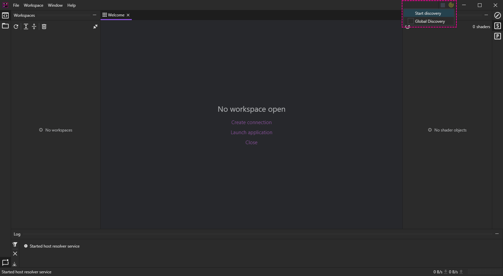

The toolset is now listening to new applications on the current machine, please start your application of choice using either Vulkan or DX12. 
Proceed to click the connection icon (1), and select your launched application (2). Either double click the application entry or click Connect (3). 

To instrument the entire application, right-click the newly created workspace (1) and select the desired instrumentation (2).

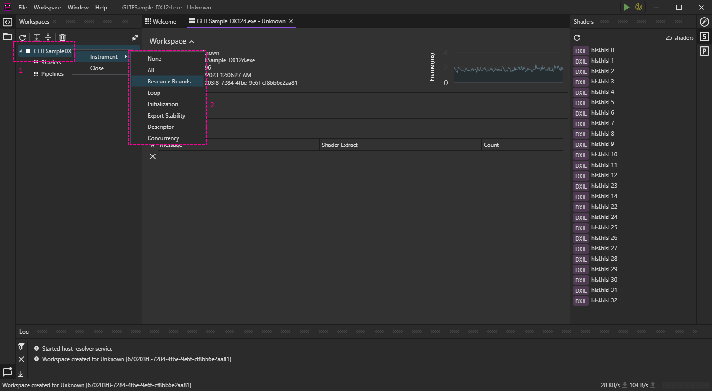

Once instrumented, any validation error is reported in the Messages pane.

To see exactly where the error occurred, double click any error of relevance.

This shader document will show you exactly where the error occurred, and allow you to request further information by clicking the right most
red box. Behind the scenes this will reinstrument the specific shader on the fly, and proceed to export additional data.

Please note how you can see the resource name, dimensions, and exactly what coordinates were accessed. In this particular example the GLTFSample (GPU Open)
shader is under-flowing, casting a signed value (-1) to unsigned, accessing the resource well outside the intended coordinates.

This represents the typical usage of GPU Reshape, however, the toolset comes with numerous additional features not covered by the above. For
more information, please see the [Usage](#4-usage) section below.

## 4. Usage

For typical usage, please refer to the four areas highlighted below.

### 4.1. Workspace Tools

The workspace tools support manipulation of workspaces and selected objects. See sections below:
- [Workspace Explorer](#5-workspace-explorer)
- [File Explorer](#6-file-explorer)

**Workspaces** are essentially a connection to an application, more specifically, a connection to the underlying graphics device. 
Not all applications are eligible for a connection, either the [application has been launched](#14-application-launching) with the tool, or
[discovery](#12-discoverability) has been enabled.

### 4.2. Object tools

The object tools allow for manipulation of objects within a workspace. See sections below:
- [Shader Objects](#7-shader-objects)
- [Pipeline Objects](#8-pipeline-objects)

### 4.3. Instrumentation mode and discoverability

The current [Instrumentation State](#13-instrumentation-mode) and [Discoverability](#12-discoverability).

### 4.4. Logging

Standard logging view, provides a list of events and their severity.

#### 4.5. Menu

The menu contains an additional set of operations. Typical usage does not require the menu.

#### 4.5.1. File

Currently, only contains the Settings menu.

#### 4.5.2. Workspace

This menu allows for workspace creation and destruction, however, atypical to the workspace tool it also allows
[launching an application](#14-application-launching). In case that discoverability is not desired, applications can be launched
manually from the tool with instrumentation enabled.

#### 4.5.1. Window

Layout manipulation.

#### 4.5.1. Help

About window and documentation links.

### 4.6. Documents

All documents live in this pane, such as [workspaces](#10-workspaces) and [shader objects](#7-shader-objects).

### 5. Workspace Explorer

The workspace explorer contains all active workspaces. Please refer to [Workspaces](#10-workspaces) for how to manipulate existing workspaces.

To connect to an existing application, the right most (2) button will open the connection window.

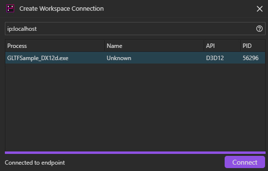

The workspace connection window will display all known applications. You may see multiple entries for the same application if
said application creates multiple devices, this will be improved in the future.

Typical usage simply means double-clicking the application of interest, or clicking connect on the entry. Advanced connections
and filtering can be done from the connection string, the _help_ pane can be made visible by clicking the question mark.

Once a connection has been created, you may find it added to the workspace explorer.

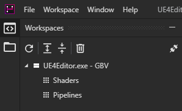

### 6. File Explorer

The files tool displays all files within a shader object, this tool is only active when a shader object is in focus.

To view the contents of any particular file, click the item in the list.

### 7. Shader Objects

The shader object tool lists all created shaders within an application.

Instrumentation can be done on a per-shader basis by right-clicking the shader, and then performing standard instrumentation.

### 8. Pipeline Objects

The pipeline object tool lists all created pipelines within an application.

Instrumentation can be done on a per-pipeline basis by right-clicking the pipeline, and then performing standard instrumentation.

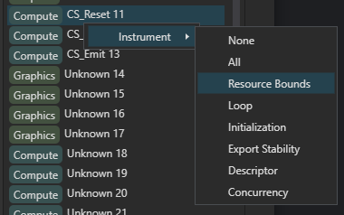

### 9. Properties

Objects and workspaces may be configurable, if this is the case, the property tool will contain all relevant properties.

### 9.1. Workspace Properties

- `Synchronous Recording`, enables stalling on instrumentation, command recording waits on any pending compilation.

### 9.2. Instrumentation Properties

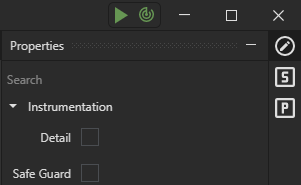

- `Detail`, enables detailed exports. This typically does not need to be enabled manually, and is instead enabled on demand in the
shader document.
- `Safe Guard`, enables safe-guarding. If an operation is erroneous, it will not be executed. If the result has intra-shader side effects,
the results will be set to zero.

### 10. Workspaces

The current status and validation messages within a workspace may be found in the workspace document.

Upon instrumentation, if any validation errors are found they will be listed in the Messages pane.

To navigate to the exact line in question, double-click the validation error.

#### 10.1. Workspace Instrumentation

Instrumentation can occur on a global scope, shader scope or pipeline scope.
- Global. Instrumentation of all pipelines and shaders.
- Shader. Instrumentation on a specific shader object, this automatically propagates to all affected pipelines.
- Pipeline. Instrumentation on a specific pipeline object, this automatically propagates to all affected shaders.

In addition, pipeline specific instrumentation may be done in bulk by filtering. Note that shader filters are currently not supported.

To enable global instrumentation, right-click the workspace in question and select the specific kind of instrumentation desired.

To perform pipeline or shader wise instrumentation, refer to the pipeline / shader objects tools. To, however, create a pipeline filter
right-click the pipelines item.

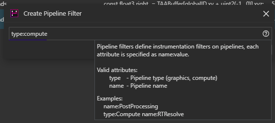

This creates an instrumentable object, which can be manipulated as if a workspace.

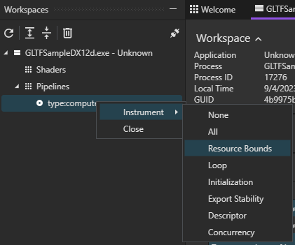

All instrumentation can be stopped on a per-feature basis or entirely, simply right-click the instrumentable and click close.

### 11. Shaders

The shader document shows the shader contents visible to the tool, and inlines all errors within.

When a shader document is marked in focus, the [File Explorer](#6-file-explorer) will list all relevant files within. File navigation
may be done through this.

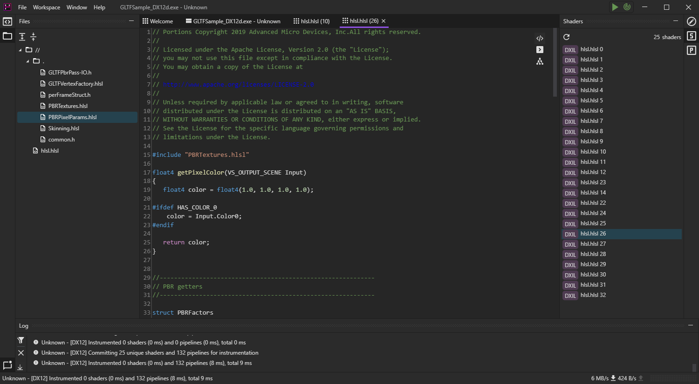

In case a validation error is present, it will be displayed in bold red. Additional information can be extracted by 
clicking the right most red text. This will reinstrument the specific shader with additional details on the fly. Once recompilation is done, 
typically within a few milliseconds, but in practice a little more due to network latency, the detailed information is presented.

The left most pane displays the resource that caused the fault, and the right most pane displays the errors 
associated with that particular resource. Please note the number associated with a resource, this number represents the version of the resource.
Resources may be recreated, moved, etc... during the lifetime of an application, with different dimensions and other
creation details.

Validation errors, or shaders themselves, may also be explored through the custom intermediate language.

Note that detailed instrumentation is available to all shaders, and may be done on a global scope. However, for the sake
of performance, detailed exporting is only enabled for the specific shader as mentioned before. This can be seen in the
workspace explorer.

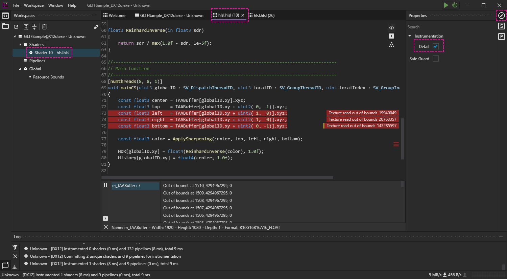

There is no magic here, besides what happens in the backend, this instrumentation override for the shader can be closed / stopped
as usual.

### 12. Discoverability

Discoverability is the ability to connect to applications not launched from the toolset. The tool does not require
discoverability to operate, but it does ease usage considerably.

Discoverability can be enabled in two ways, either to the current session, or globally. If the former, discoverability
is disabled when the application is closed. However, if global, it remains active after closure, and through restarts.
If discoverability was successfully enabled, the icon turns green.

It may be disabled by either disabling the checkbox "Global Discovery", or through the notification icon.

When discovery is enabled, either session wise or globally, a notification icon is added to the windows tray. Please 
note that the icon may be collapsed, for convenience it is recommended to pin it.

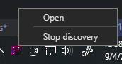

When enabled, discoverability can also be disabled through said icon. You may also open the application from the icon.

### 13. Instrumentation mode

The left most play button represents the instrumentation state, which can either be enabled or paused. It can be toggled by clicking
said button. If green, instrumentation changes are immediate.

If yellow, changes are only applied once enabled (green) again.

This is particularly useful for changing many settings without incurring immediate instrumentation. Instrumentation may be a heavyweight operation
depending on the number of pipelines and unique shaders.

### 14. Application Launching

Workspaces can be launched without discoverability if desired, which ensures the injection is local to the application from launch.

This is particularly useful to instrumentation modes that require visibility from startup, such as Initialization instrumentation. And allows
configuration of workspace and instrumentation settings.

Typical to most tools, you may find the application path, working directory and given arguments. Below this you may configure the kind of instrumentation.

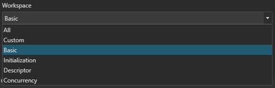

These all represent particular features, All being all stable features (excludes Loop), Basic being Resource Bounds and Export Stability. 

Most workspace types have either of two configurables:
- "Safe guarding", this enables safe guarding, that is, additional instrumentation that prevents undefined behaviour from taking place. For example,
  an invalid descriptor sampler instead becomes a NOOP.
- "Synchronous recording", this enables recordings to wait on all instrumentation, which ensures all shaders have finished instrumenting before recording
  of command lists. This considerably worsens startup times and results in hitching, most features do not require this, however, Initialization does.

A "Custom" workspace allows you to create your own workspace as one would with typical attaching.

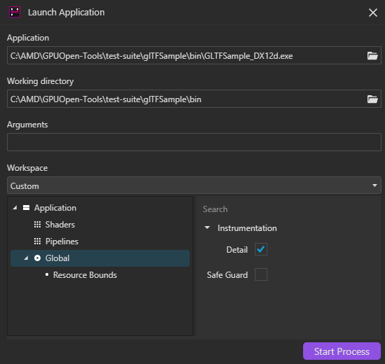

Once launched, the tool waits for the application to register itself, and then proceeds to create a workspace for it.

### 15. Settings

**! Settings visuals require quite a visual overhaul, please do not worry, the final visuals will look nothing like the below. !**

Under settings certain application configurables can be modified. For the purpose of this guide, only the "Applications" settings will be discussed.

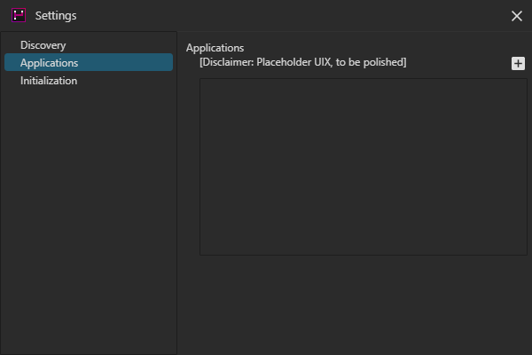

Under "Applications", you may configure individual application behaviour with GPU Reshape. To add a new entry, click "+". To edit the name, 
click the entry and name it the target executable.

Under the application settings you may configure two things.

**Enable IL Conversion**. This enables DXBC -> DXIL conversion for DXBC capable instrumentation, this is an experimental feature. Debug symbol support within
converted ils is not supported, however, validation data is just fine. So, you may inspect validation errors, resource names, etc...

**Symbol Paths**. This is for external PDB support, to add a new search path click the "+" button. If you wish to enable recursive support enable "Search sub-directories",
**however**, this is indexed on startup and may incur longer startup times, please ensure the search paths only contain relevant files.
