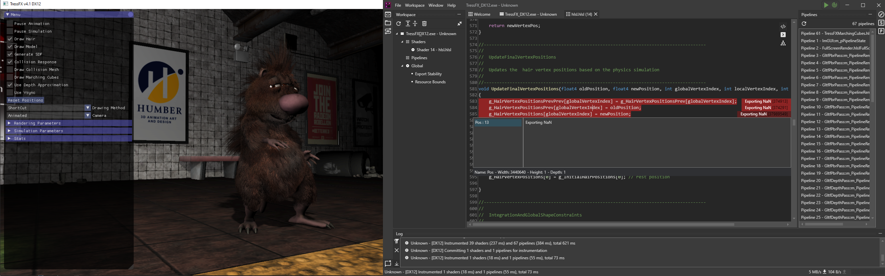

# GPU Open - GPU Reshape - Article

---

Have you ever used GPU debug validation layers? Well, what a question. I'm pretty sure you have. Why shouldn't you, as it points you straight to various issues in your code, when you once again violated the spec. Everyone does this sometimes. It's fine, that's why we have validation layers. It helps us to make sure we write legal, spec complying code.
But what if the corruption still persists, even if the validation layer is happy? A buggy validation layer? A buggy driver? Well, perhaps.

Or, the buggy code is just not checked by the validation layer. Welcome to shader code 😈 and congratulations to an hours-long debugging session to find the culprit. Did you forget again to initialize a placed resource? Or did you try to access an unbound resource? Or something completely different?

Did you ever wished that there is some tool out there that helps you? That warns you, if you write code that potentially results in undefined behavior? That causes coruptions, or worse, random crashes?

-----------------------------------------
ALTERNATIVE, SHORTER: Ever wondered if your shader code is safe and does not end up in undefined behavior land? Tired of crashes due to accessing unbound resources or hunting down corruptions as you forgot once again to initialize them?

-----------------------------------------

Please meet GPU Reshape, a toolset that leverages on-the-fly instrumentation of GPU operations 
with instruction level validation of potentially undefined behavior, supporting both DX12 & Vulkan. No integration required.

---

My name is Miguel Petersen, Senior Rendering Engineer at Striking Distance Studios, author of GPU Reshape.
The toolset was developed in collaboration with AMD and Avalanche Studios Group, initially as a proof-of-concept Vulkan layer at Avalanche, after which
development was continued externally.

The development was supported by Lou Kramer, Jonas Gustavsson, Marek Machlinski, Daniel Isheden, and William Hjelm. Thank you all.

### Making the GPU a First Class Citizen

---------------------------------------
OLD VERSION: Modern graphics units are powerful, but highly complex. Debugging issues, much less knowing where or even if they are issues on the application side,
remains a consistent challenge. It can prove tedious and occupy significant development time.

GPU Reshape aims to change this by bringing powerful features typical of CPU tooling to the GPU, such as:

--------------------------------------

GPU Reshape aims to bring powerful features typical of CPU tooling to the GPU. This includes:

- **Resource Bounds**   Validation of resource read / write coordinates against its bounds.
- **Export Stability**   Numeric stability validation of floating point exports (unordered writes, render targets).
'precise' storage class modifier?
- **Descriptor Validation**   Validation of descriptors, potentially dynamically indexed. This includes undefined, mismatched (compile-time to runtime), and out of bounds descriptor indexing.
- **Concurrency Validation**   Validation of resource concurrency, i.e. single-producer or multiple-consumer, between queues and events.
- **Resource Initialization**   Validation of resource initialization, ensures any read was preceded by a write.
- **Infinite Loops**   Detection of infinite loops.

Validation errors are reported on the exact line of code of the instruction, with, for example, the resource, dimensions, and coordinates accessed.

-------------------------------------------
Screenshot - zoomed in with example

-------------------------------------------

---- Issues with compiler re-ordering optimization? -----

Additionally, certain features, such as descriptor validation, can safeguard a potentially erroneous operation, preventing undefined behaviour during instrumentation. This is especially useful if the error would result in a GPU crash, limiting the application's ability to write out useful debug information of the issue.

----- Remove? -----

Future feature scopes includes profiling and debugging functionality, such as branch hot spots, live breakpoints, and assertions.
For further information, please see the public repository.

----- Remove? -----

### Instrumentation as a Framework

GPU Reshape, at its core, is a modular API-agnostic instrumentation framework.
It performs appropriate call hooking, instrumentation of shader code and any additional state management CPU side.
Not all features make use of shader instrumentation, some validation may be performed entirely during call hooking. (EXAMPLE?).

Shader instrumentation is done on a generalized SSA-based intermediate language. It's a custom intermediate language, specifically written for GPU Reshape and is bi-directionally translated to the backend language - namely SPIR-V and DXIL. Each feature, such as the validation of out-of-bounds reads, operates solely on the intermediate language and has no visibility on the backend language nor API.
This also means, that any new feature will automatically be supported for both, SPIR-V and DXIL. And to add a new backend language, let's say DXBC, one does not need to care about the individual features, but to add a bi-directional translation between the intermediate language and the new backend language.

Each feature can alter the program as it sees fit, such as adding basic-blocks, modifying instructions, 
and even removing instructions. The feature is given a Program

------------------------------------------------
What do you mean by Program? Shader kernel?

------------------------------------------------

, which act as the abstraction for the active backend, 
from which the user has access to all functions, basic-blocks, instructions, types, etc..., and is able to modify as necessary. After modification, the backend then performs just-in-time recompilation of the modified program back to the backend language.

---- Example? ----

Features do not need to concern themselves with backend specifics, such as vectorized versus scalarized execution, 
control-flow requirements, and other implementation details. Given compliance, each feature will translate seamlessly 
to the backend language.

GPU Reshape aims to serve as a framework for instrumentation, acting as a modular base from which any number of tools, 
techniques and optimizations can be implemented. It is my hope, with time, it matures and evolves into a general purpose tool that can be of aid to the industry.

### Ending notes 

[[Miguel P: .. things to add here, can't end with the dry stuff above!]]

[[Miguel P: Do I add these here? Not sure, I don't know much about legalities]]

Copyright © 2023 Miguel Petersen  
Copyright © 2023 Advanced Micro Devices  
Copyright © 2023 Avalanche Studios Group