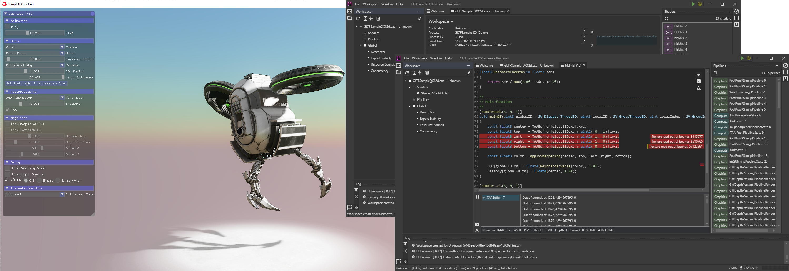

# GPU Open - GPU Reshape - Article

---

Modern APIs are rapidly growing in complexity, with each added feature introducing more responsibility and risk. Typically, the first tool we turn to
is the standard set of validation layers, to ensure we write specification compliant code. However, what if the problem persists despite the lack of
validation errors? Is it due to a bug in the validation layers, or perhaps even a bug in the driver?

What if the error is within a shader? Is it due to dynamic behaviour that cannot be statically validated? If so, this can result in hours-long debugging 
sessions to find the one culprit among a heap of operations. Perhaps the index was out of bounds? Was a NaN was propagated across multiple stages? Did you
forget to initialize something?

Have you ever wished for a tool that validates dynamic shader behaviour? Warning you on code that results in undefined behaviour, causes corruption, 
or worse, even random crashes?

---

Please meet GPU Reshape, a toolset that leverages on-the-fly instrumentation of GPU operations with instruction level validation of potentially 
undefined behavior, supporting both DX12 & Vulkan. No integration required.

---



My name is Miguel Petersen, Senior Rendering Engineer at Striking Distance Studios, author of GPU Reshape.

The toolset was developed in collaboration with AMD and Avalanche Studios Group, initially as a proof-of-concept Vulkan layer at Avalanche, 
after which development was continued externally. Development supported by Lou Kramer, Jonas Gustavsson, Rys Sommefeldt, Marek Machlinski, Daniel Isheden, 
and William Hjelm. Thank you all.

### Making the GPU a First Class Citizen

GPU Reshape brings powerful features typical of CPU tooling to the GPU, providing validation of dynamic behaviour, such as:

- **Resource Bounds** </br> Validation of resource read / write coordinates against its bounds.
- **Export Stability** </br> Numeric stability validation of floating point exports (unordered writes, render targets).
- **Descriptor Validation** </br> Validation of descriptors, potentially dynamically indexed. This includes undefined, mismatched (compile-time to runtime), and out of bounds descriptor indexing.
- **Concurrency Validation** </br> Validation of resource concurrency, i.e. single-producer or multiple-consumer, between queues and events.
- **Resource Initialization** </br> Validation of resource initialization, ensures any read was preceded by a write.
- **Infinite Loops** </br> Detection of infinite loops.

Additionally, certain features, such as descriptor validation, can safeguard a potentially erroneous operation, preventing undefined behaviour 
during instrumentation. This is especially useful if the error would result in a GPU crash, limiting the application's ability to write out 
useful debug information of the issue.

-------------------------------------------

Validation errors are reported on the exact line of code of the instruction, with, for example, the resource, dimensions, and coordinates accessed.


-------------------------------------------

In case symbols are not available, or is not desired, validation errors may be reported on the offending instruction instead.


-------------------------------------------

Out of the box usage requires no integration, and can be done in just a few clicks. The toolset aims to bring you as much information as possible in 
order to investigate and resolve faults, with interactive instrumentation of applications in a matter of seconds. However, under the hood GPU Reshape is a little
more than a fixed toolset.

### Instrumentation as a Framework

GPU Reshape is, at its core, a modular API-agnostic instrumentation framework. Performing appropriate call hooking, instrumentation of shader code
and any additional state management CPU side.

Shader instrumentation is done on a generalized [SSA-based](https://en.wikipedia.org/wiki/Static_single-assignment_form) intermediate language. 
It's a custom intermediate language, specifically written for GPU Reshape and is bi-directionally translated to the backend language - namely SPIR-V 
and DXIL. Each feature, such as validation of out-of-bounds reads / writes, operates solely on the intermediate language and has 
no visibility on neither backend language nor API.

Decoupling features from backends through a custom intermediate language has a number of benefits. It keeps permutations low, as features do not
need an implementation per backend, and introducing backends does not require feature changes. As the number of features and backends grows, 
this becomes paramount. The intermediate language also allows for a standardized toolset across backends, significantly lowering the complexity
of writing instrumentation code. On top of this, the bi-directional translation is single layered, meaning it's translated to and from the backend 
binaries directly, without other intermediate languages. This greatly improves translation speeds, a typical shader is instrumented in just a couple
of milliseconds (varies on shader complexity).

Each feature can alter the program as it sees fit, such as adding, removing and modifying instructions. The feature is given a shader "program", 
which act as the abstraction for the active backend, from which the user has access to all functions, instructions, constants, types, etc..., and 
is able to modify as necessary. After modification, the backend then performs just-in-time recompilation of the modified program back to the backend 
language.

Features do not need to concern themselves with backend specifics, such as vectorized versus scalarized execution, control-flow requirements, 
and other implementation details. Given **compliance**, each feature will translate seamlessly to the backend language.

### Writing a Feature

(Miguel P: Perhaps too long, could condense it by not including the final function)

That was a lot of words, let's showcase this by writing a simple feature which validates buffer load bounds, and writes out data when out of bounds. 
For simplicity, we are skipping initialization code, and only focusing on the actual instrumentation. Suppose we have the class `ResourceBoundsFeature`
which implements `IShaderFeature`, when any shader is to be instrumented by this feature, the function `Inject` is called.
```cpp
void ResourceBoundsFeature::Inject(IL::Program &program, const MessageStreamView<> &specialization) {
   ...
}
```

We could manually walk through the program, functions, and instructions, to perform our modifications. However, keeping track of which instructions are already instrumented, much less across different features, is not a trivial issue. Luckily, the helper function `VisitUserInstructions` removes all that pain.

```cpp
void ResourceBoundsFeature::Inject(IL::Program &program, const MessageStreamView<> &specialization) {  
    IL::VisitUserInstructions(program, [&](IL::VisitContext& context, IL::BasicBlock::Iterator it) -> IL::BasicBlock::Iterator {
        // Not a load buffer instruction? Skip it.
        if (!it->Is<IL::LoadBufferInstruction>()) {  
            // The return value defines where iteration is to be continued from
            return it;  
        }
        
        ... instrumentation!
    });
}
```

Great! Now we can visit all `LoadBufferInstruction`'s. So, to help reason about things let's model what we want to do in (pseudo) HLSL.

```cpp
// Validation
if (any(coordinates > buffer.GetDimensions())) {
    // Suppose Export(...) makes GetErrorData() visible to the CPU
    Export(GetErrorData());
}

// The user instruction
type value = buffer.Load(coordinates);
```

What we really want is a branch just before the user instruction. Following a traditional SSA nature, we need to split the "basic block" of the user 
instruction. Basic blocks can be thought of a sequence of instructions without branching, except for the last instruction which may branch to another 
basic block.

So, to satisfy this constraint, we require two new basic blocks. One for continuation, named resume, and one for exporting the data, named error 
block. The logic is simple, if the validation condition `any(coordinates > buffer.GetDimensions())` fails, we branch to the error block, otherwise
resume block. Let's write it up.

```cpp
// Allocate blocks  
IL::BasicBlock* resumeBlock = context.function.GetBasicBlocks().AllocBlock();  
IL::BasicBlock* errorBlock  = context.function.GetBasicBlocks().AllocBlock();
  
// Split this basic block, inclusive from iteration point
auto instr = context.basicBlock.Split(resumeBlock, it);

// Emitters take care of creating instructions
IL::Emitter emitter(program, context.basicBlock);  
  
// any(coordinates > buffer.GetDimensions())
IL::ID failureCondition = emitter.Any(emitter.GreaterThanEqual(
    loadBuffer->index,
    emitter.ResourceSize(loadBuffer->buffer)
));  
  
// Branch to error block if the condition failed, otherwise resume block
emitter.BranchConditional(
    failureCondition,
    errorBlock, 
    resumeBlock, 
    IL::ControlFlow::Selection(resumeBlock)
);

// Continue past the iterator
return instr;
```

Let's take a look at the above. First, we allocate the new blocks. Then, we split the current block from the current iterator, meaning all 
instructions including the buffer load are moved to `resumeBlock`. Finally, we append instructions to the current basic block, branching to 
either `errorBlock` or `resumeBlock` depending if the load index exceeds the resource bounds. Please note the `Selection` control flow, 
compliance against all backends requires control flow specifiers, to keep things brief this is omitted.

Now, all that's missing is the `errorBlock`. We want to export some data, but what data? And how is it to be read? And how do we associate 
instructions / lines of sources with said data? No worries, the framework takes care of that for you. All you need to do is define your schema, 
which is a small xml file with a couple of attributes.

```xml
<schema>
    <shader-export name="ResourceIndexOutOfBounds">
        <field name="isTexture" type="uint32" bits="1"/>
        <field name="isWrite" type="uint32" bits="1"/>
    </shader-export>
</schema>
```

From this schema bindings are auto-generated, specifically for the IL (GPU), C++ (CPU) and C# (CPU).

```cpp
IL::Emitter emitter(program, *errorBlock);

// Prevent this basic block from being instrumented.
// Otherwise, other features may try to mess with the instructions.
emitter.AddBlockFlag(BasicBlockFlag::NoInstrumentation);  
  
// Initialize and export the auto-generated message
ResourceIndexOutOfBoundsMessage::ShaderExport msg;
msg.isTexture = emitter.UInt32(0u);  
msg.isWrite = emitter.UInt32(0u);  
emitter.Export(exportID, msg);  
  
// Branch back  
emitter.Branch(resumeBlock);
```

With the generated bindings, memory packing and handling is entirely automated. All you need to do is initialize the generated structure, and 
invoke Export on it. Note the  `exportID`, this denotes the type of export, which is allocated once during initialization.

To associate `msg` with a specific instruction, we make use of shader source GUIDs. The actual nature of these GUIDs don't matter, and are 
backend specific, all that matters is that from a specific GUID the exact line of code and instruction can be back traced. All messages contain 
an `sguid` field for back tracing support, so we just need to plug it in.

```cpp
// Binding creates an entry for a specific instruction and the ShaderSGUID
ShaderSGUID sguid = sguidHost->Bind(program, it);

// Initialize and export the auto-generated message
ResourceIndexOutOfBoundsMessage::ShaderExport msg;  
msg.sguid = emitter.UInt32(sguid);
...
```

And that's it! From this, we have instrumentation of all buffer load instructions, successfully writing back data to the CPU. Let's see the full 
function:

```cpp
void ResourceBoundsFeature::Inject(IL::Program &program, const MessageStreamView<> &specialization) {  
    IL::VisitUserInstructions(program, [&](IL::VisitContext& context, IL::BasicBlock::Iterator it) -> IL::BasicBlock::Iterator {  
        // Not a load buffer instruction? Skip it.  
        if (!it->Is<IL::LoadBufferInstruction>()) {
            // The return value defines where iteration is to be continued from  
            return it;    
        }  
        
        // Bind the SGUID  
        ShaderSGUID sguid = sguidHost->Bind(program, it);  
        
        // Allocate blocks  
        IL::BasicBlock* resumeBlock = context.function.GetBasicBlocks().AllocBlock();  
        IL::BasicBlock* errorBlock  = context.function.GetBasicBlocks().AllocBlock();  
        
        // Split this basic block, inclusive from iteration point  
        auto instr = context.basicBlock.Split(resumeBlock, it);  
        
        // Iterator is invalidated from last split  
        auto* loadBuffer = it->As<IL::LoadBufferInstruction>();  
        
        // Error block instructions  
        {  
            IL::Emitter emitter(program, *errorBlock);  
            
            // Prevent this basic block from being instrumented.  
            // Otherwise, other features may try to mess with the instructions.
            emitter.AddBlockFlag(BasicBlockFlag::NoInstrumentation);    
            
            // Initialize and export the auto-generated message  
            ResourceIndexOutOfBoundsMessage::ShaderExport msg;  
            msg.sguid = emitter.UInt32(sguid);  
            msg.isTexture = emitter.UInt32(0u);    
            msg.isWrite = emitter.UInt32(0u);    
            emitter.Export(exportID, msg);    
            
            // Branch back    
            emitter.Branch(resumeBlock);  
        }  
        
        // Emitters take care of creating instructions  
        IL::Emitter emitter(program, context.basicBlock);    
        
        // any(coordinates > buffer.GetDimensions())  
        IL::ID failureCondition = emitter.Any(emitter.GreaterThanEqual(  
            loadBuffer->index,  
            emitter.ResourceSize(loadBuffer->buffer)  
        ));    
        
        // Branch to error block if the condition failed, otherwise resume block  
        emitter.BranchConditional(  
            failureCondition,
            errorBlock,
            resumeBlock,
            IL::ControlFlow::Selection(resumeBlock)  
        );  
        
        // Continue past the iterator  
        return instr;  
    });
}
```

If we ignore the schema and comments, instrumentation is a mere 34 lines of code. This is by no means a universal metric, however, does demonstrate 
how simple instrumentation can be.  Please keep in mind that something needs to deal with those messages, and handle presentation. In addition, the 
actual resource bounds feature exports more data, such as the offending resource and which indices were accessed, which increases complexity.

### Ending notes


GPU Reshape aims to serve as a framework for instrumentation, acting as a modular base from which any number of tools, techniques and optimizations 
can be implemented. It is my hope, with time, it matures and evolves into a general purpose tool. 

Join us over at [Github](https://github.com/GPUOpen-Tools/GPU-Reshape). Collaboration, discussion, and bug reporting is most welcome!
