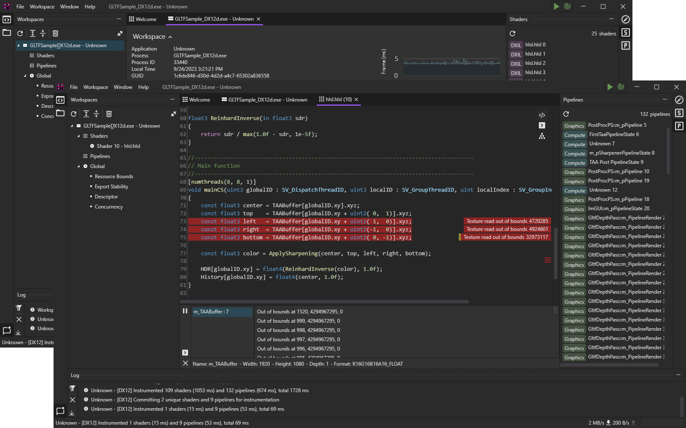

<h1> <a>GPU Reshape</a></h1>

**GPU Reshape** offers API agnostic instrumentation of GPU side operations to perform, e.g., validation of potentially undefined behaviour, supporting both Vulkan and D3D12 (DXIL).
No application side integration is required.

GPU Reshape is an open collaboration between **Miguel Petersen** (author), **Advanced Micro Devices** and **Avalanche Studios Group**.

---

  <a href="Documentation/QuickStart.md">Quick Start</a> -
  <a href="Documentation/Features.md">Features</a> -
  <a href="Documentation/Build.md">Build</a> -
  <a href="Documentation/API.md">API</a> -
  <a href="Documentation/Motivation.md">Motivation</a> -
  <a href="Documentation/UIX.md">UIX</a>

---

Current feature scope provides instrumentation on operations which are either undefined behaviour, or typically indicative of user fault such as:

- **Resource Bounds**   Validation of resource read / write coordinates against its bounds.
- **Export Stability**   Numeric stability validation of floating point exports (UAV writes, render targets, vertex exports), e.g. NaN / Inf.
- **Descriptor Validation**   Validation of descriptors, potentially dynamically indexed. This includes undefined, mismatched (compile-time to runtime), out of bounds descriptor indexing, and missing table bindings.
- **Concurrency Validation**   Validation of resource concurrency, i.e. single-producer or multiple-consumer, between queues and events.
- **Resource Initialization**   Validation of resource initialization, ensures any read was preceded by a write.
- **Infinite Loops**   Detection of infinite loops. _Experimental_.

The future feature scope includes profiling and debugging functionality, such as branch hot spots, live breakpoints, and assertions. 
For the full planned feature set, see [Features](Documentation/Features.md).

## Instrumentation as a framework

The toolset provides a generalized SSA-based intermediate language from which all instrumentation is done, bi-directionally translated to SPIRV and DXIL.
Each feature, such as the validation of out-of-bounds reads, operates solely on the intermediate language and has no visibility on the backend language nor API.

Each feature can alter the program as it sees fit, such as adding basic-blocks, modifying instructions, and even removing instructions. The feature is given a [Program](Documentation/API/IL.md), which
act as the abstraction for the active backend, from which the user has access to all functions, basic-blocks, instructions, types, etc..., and is able to modify as necessary.
After modification, the backend then performs just-in-time recompilation of the modified program back to the backend language.

The toolset additionally provides a set of building blocks needed for instrumentation:

- [Message Streams](Documentation/API/Message.md) help facilitate GPU -> CPU communication, and also serves as the base for inter-process/endpoint communication.
- Persistent data such as buffers, textures and push / root constants, visible to all instrumentation features. Certain features require state management.
- User programs, entirely user driven compute kernels written through the intermediate language. All persistent data visible.
- User side command hooking, certain features may wish to modify state, invoke kernels, before the pending command.
- Resource tokens, abstracting away differences in binding models by providing a token from shader resource handles. Each token provides a physical UID, resource type and sub-resource base.
- Command scheduling, record and submit custom (abstracted) command buffers / lists.

Features do not need to concern themselves with backend specifics, such as vectorized versus scalarized execution, control-flow requirements, and other implementation details. Given compliance, each feature
will translate seamlessly to the backend language.

This toolset aims to serve as a **framework** for instrumentation, acting as a modular base from which any number of tools, techniques, optimizations, etc..., can be implemented. 

## Testing Suite

A list of applications GPU Reshape is tested against for stability and validity.

Games
- **Call of the Wild: The Angler** (Avalanche, DX12)
- **Second Extinction** (Avalanche, Vulkan)
- **Rage 2** (Avalanche / id Software, Vulkan)
- **Chernobylite** (The Farm 51, DX12)
- **Dying Light 2** (Techland, DX12)
- **The Lord of the Rings: Gollum** (Daedalic Entertainment, DX12)
- **A Plague Tale: Requiem** (Asobo Studio, DX12)
- **Ratchet & Clank: Rift Apart** (Insomniac Games / Nixxes Software, DX12)
- **Forspoken** (Square Enix, DX12)
- **The Riftbreaker** (EXOR Studios, DX12)
- **Starfield** (Bethesda Game Studios, DX12)
- **Cyberpunk 2077** (CD PROJEKT RED, DX12)

Engines
- **Unreal Engine 4** (Epic Games, DX12, Vulkan)
- **Unreal Engine 5** (Epic Games, DX12, Vulkan)

AMD
- **FidelityFX-SDK** (DX12, Vulkan)
- **FSR2** (DX12, Vulkan)
- **GLTFSample** (DX12, Vulkan)
- **ParallelSort** (DX12, Vulkan)
- **SPDSample** (DX12, Vulkan)
- **SSSRSample** (DX12, Vulkan)
- **TressFX** (DX12, Vulkan)

Khronos
- **Vulkan-Samples** (Vulkan, *certain extensions pending support, e.g. descriptor buffers*)

Microsoft
- **MiniEngine ModelViewer** (DX12)

## Known Issues

- Raytracing and mesh shaders are currently pass-through, no instrumentation is done on them.
- Initialization feature false positives. Resources can be initialized in a myriad of ways, this will be improved with time.
- Loop feature not catching all timeouts. The loop feature is currently experimental, and relies on non-standard guarantees.
- Application launches, not attaching, will only connect to the first device, which may not necessarily be the intended device.

## Credit

GPU Reshape was initially developed as a prototype tool by Miguel Petersen at Avalanche Studios Group, extending validation tools to shader side operations.
It was then requested to continue development externally through an open collaboration on GPUOpen.

Development was supported by:

- Lou Kramer (AMD)
- Jonas Gustavsson (AMD)
- Marek Machlinski (AMD)
- Rys Sommefeldt (AMD)
- Mark Simpson (AMD)
- Daniel Isheden (Avalanche Studios)
- Alexander Polya (Avalanche Studios)
- Wiliam Hjelm (Avalanche Studios)

Copyright (c) 2024 Advanced Micro Devices, Inc., 
Fatalist Development AB (Avalanche Studio Group), 
and Miguel Petersen.

All Rights Reserved.
