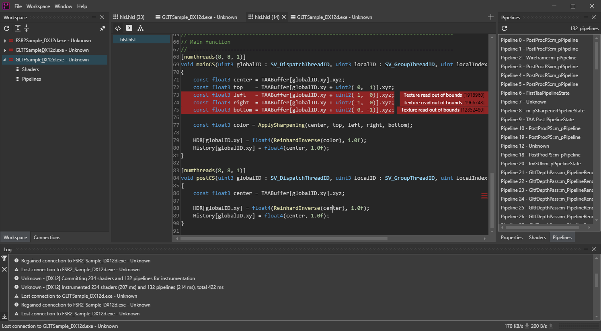

# GPUOpen - GPU Based Validation

An open collaboration between AMD, Avalanche Studios and Miguel Petersen. \
_( just example crediting, I'm sure there's a far more professional / official way to go about this! )_

---

[Build](Documentation/Build.md) -
[UIX](Documentation/UIX.md) -
[API](Documentation/API.md) -
[Motivation](Documentation/Motivation.md) -
[Design](Documentation/Design.md) -
[Features](Documentation/Features.md) -
[Proof of concept](Avalanche/ReadMe.md)

---

Sample screenshot showcasing early UIX development, demonstrating a functional 
application stack to mature projects. **The UIX is less than a month old, functionality and visuals will improve drastically over time.**

## The life of a validation message

### Connection

Any application using a supported API (Vulkan, DX12 *1) first attempts communication
with the host resolver service. The host resolver service is responsible for general 
discoverability and handshakes between clients and applications. If the host resolver service 
cannot be found, an instance is started. Once connected, general application information is
submitted such as the name, API and process ID.

The remote client, i.e. instance of the UIX above, connects to the host resolver at specified IP 
(no restriction on endpoint) and preconfigured port. Once connected, the client requests all discovered
applications on the target machine, and their associated metadata. Once an application has been selected,
a connection request is sent to the host resolver.

Upon receiving a connection request, the host resolver passes this to the respective application and requests
that the client instantiates a local server. The application server is created on demand as to not
pollute local ports. Once instantiated, the system allocated port is sent to the host resolver, which sends 
the dedicated connection information back to the remote client.

The remote client now holds a dedicated connection to the application.

(1) DX12 support is a work in progress

### Instrumentation

The remote client requests instrumentation of all pipelines / shaders by sending the respective messages to the application.
Through the dedicated connection, all communication is performed through the language-agnostic messaging API. 

Once recieved, the application begins JIT recompilation of all affected shader modules and pipelines, through the API-agnostic bi-directional intermediate language.
The instrumentation is entirely modularized, and operates solely on the mentioned intermediate language.

Once the instrumentation request has completed, the backend pushes the instrumentation state for succeeding command buffers / lists.
And performs all relevant state management.

Up-stream message (GPU to CPU) exporting on shader instrumentation failures is performed through the same
agnostic messaging API. Due to the flat in-memory representation there is a zero deserialization cost, which in turn means that the
up-stream messages can be streamed directly to the remote client without any processing.

Upon validation errors, the GPU message stream is transferred over and submitted to all connected clients. Exact submission, segmentation,
and compression policy is up to the respective backend.

### Metadata

The remote client then requests numerous metadata requests, such as the active shaders, code within a shader, validation shader location lookups, etc...
anything needed to create a respectable presentation of the application state.

Everything passing through language boundaries (C++, C#), machine boundaries (networking), and even hardware boundaries (GPU, CPU)
uses the same messaging API. Any created message is entirely compatible with any of the other receivers.
Reading and writing to said messages is performed through auto-generated helpers, even for emitting messages through the intermediate language.